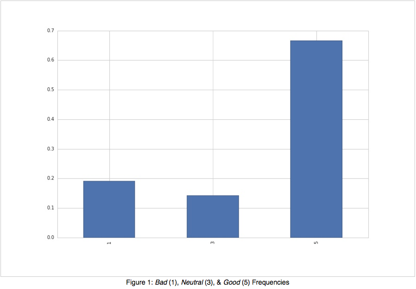
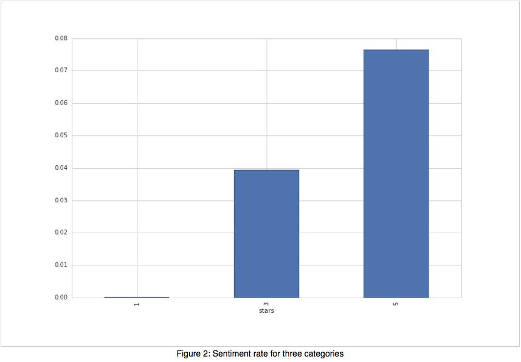
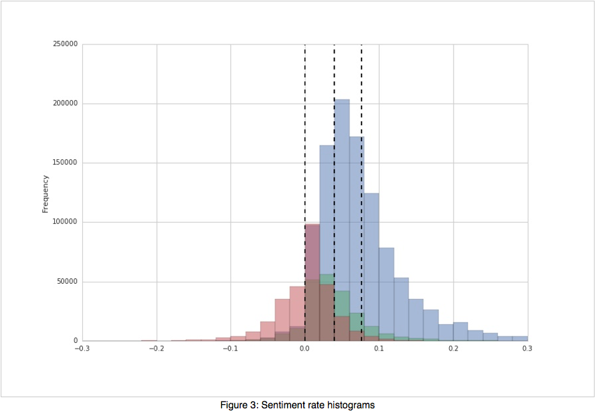

# Classification of User Star Ratings using Review Text from the Yelp Dataset Challenge

## Introduction

The field of text analytics has drawn much interest from academia and
industry in recent years for its ability to offer insight for large sets
of text data that is unreasonable to examine by a person. For our
project we chose to analyze data from the Yelp Dataset Challenge.

Yelp, Inc. is a company that enables users to rate and review all kinds
of businesses. In the area of restaurant and bar reviews, such reviews
and ratings essentially function as crowed-sourced food (and drink)
criticism. Yelp is the largest such user-supplied review web service,
and as such has very large amounts of review data. The two main parts of
a review are the text of the actual review and a star rating from one to
five.

From these reviews we are interested in predicting the actual rating
based on the review text alone. Through our analysis we hope to obtain
reliable prediction and also understand what characteristics in a review
contribute to low and high ratings. One can also expect that reliable
prediction of user satisfaction from text alone can be of use to other
data scientists and review sites and, perhaps most importantly, the
restaurants themselves.

## Data

The Yelp dataset originally contains about two million reviews of many
different business types (restaurants, hardware stores, etc.). To make
our task more tractable, only restaurants (including bars, coffee shops,
food trucks, etc.) were considered which brings our total dataset size
to about 1.6 million reviews. The total count of unique words is over
300,000. The initial features provided are:

-   Text: The plain text of the review

-   Star Rating: The response variable, condensed into three categories

    -   1-2 stars: Category *Bad*

    -   3 stars: Category *Neutral*

    -   4-5 start: Category *Good*

We see from Figure 1 that we have unequal class frequencies, with over
65% of the reviews being Good. We’ll account for this imbalance through
the choice of classifier, namely multinomial Naive Bayes.

The Yelp dataset also includes many additional features including:
reviewer, location, date, and ambiance. These features could potentially
improve the classifier, for instance we could incorporate user rating
bias, however we elected to exclude them for this analysis and focus
entirely on classification via text.

## The Classifier

The classifier has two layers. The first layer is a Naive Bayes
classifier that uses a bag-of-words model to assign probabilities
regarding membership in each of the three possible groups to each of the
reviews. These probabilities, along with other features, are then
provided to a second layer. We split the original dataset into training,
validation, and test dataset. We also utilized cross validation to tune
our models. The validation dataset was used primarily for computational
reasons, due to the size of the data the validation dataset was used to
compare various models in the exploration phase.

#### Layer 1

The first layer uses the text portion of the review to assign a
probability of membership in each of the possible outcome categories.
The raw text of each review is first processed to remove punctuation and
stop words. Even though the bag-of-words model commonly admits stemming
/ lemmatization, in this case we did not use them due to the abundance
of data and the relative brevity of the documents (reviews) and their
limited vocabulary. In fact, we found the classifier performed worse
when stemming / lemmatization was added, likely due to the loss of
information resulting from these methods.

To implement the bag-of-words model, the review texts - after
preprocessing - were transformed using the term-frequency
inverse-document-frequency (TF-IDF) transformation, and then provided to
a multinomial Naive Bayes classifier. To address the issue of a feature
(word) not appearing together with a category in the training data, a
Laplace smoothing parameter was added and tuned to prevent zero
frequencies affecting the products of conditional probabilities. The
Naive Bayes classifier is a popular classifier for the bag-of-word model
since it is fast, works well in high-dimensional space, and handles
unbalanced multiclass classification seamlessly (when using a prior). In
spite of its clearly naive assumption of word independence, it produces
fairly accurate results in practice.

The Naive Bayes classifier outputs a probability for each category
(Good, Neutral, Bad) for a given input review. Typically such a
classifier would select the highest probability as the decision rule.
However, our classifier merely treats these probabilities as features
associated with an observed review in the next layer of classification.

As an extension to the typical TF-IDF transformation approach, we also
considered *n*-grams which incorporate word ordering. In essence, we
considering a sliding window of text containing *n* words. Including all
such windows quickly becomes computational infeasible as the dimension
of the data increases rapidly. As an alternative, we found all *n*-grams
of length *n* = 4, 5, 6, 7 but kept only the most frequent 2,000 from
the training set for each of those groups. Another similar approach is
to include various length skipgrams, however we omitted such additions
due to time constraints.

#### Layer 2

To develop a more effective classifier, new features were engineered
from the existing review texts. Two new features are related to the
length of the reviews: word and character counts. Other new features
count the number of emotive punctuation, such as question marks and
exclamation points, the logic being that Good and Bad categories will
have more emotive punctuation as compared to Neutral reviews.

Yet other new features score the sentiment of the review. Known
emotional words - both positive and negative - from two sources
*SentiWordNet* and *Hu and Liu’s lexicon* are used to score the
sentiment of reviews. For example one sentiment score is obtained by
adding one (+1) for positive words and subtracting one (-1) for negative
words, while the other sentiment score uses weights in [-1, 1] on a
continuous scale. Yet another feature combines the length and sentiment
of the review for a sentiment rate.

The average sentiment rate for the three categories Bad, Neutral, and
Good is shown in Figure 2. There appears to be separation between the
classes, with the expected result of Good having a higher sentiment rate
and vice versa for the Bad. However looking at the histograms of these
sentiment rates by category show a clear overlap, see Figure 3.

These features, combined with the probability scores for each category
from layer one, are then used in the second layer of the classifier.
Using cross validation, we tuned several classifiers including: Random
Forest, AdaBoost, Gradient Boost, Linear SVM, and kNN. The SVM and kNN
performed significantly worse and were discarded. The three Decision
Tree based methods were retained, and combined using an ensemble
classifier with majority vote. Based on the confusion matrices and test
error metric, we recommend the Random Forest classifier as being
preferred. Though the boosting

classifiers performed marginally better, the computation gain of
parallel processing with Random Forests gives the largest advantage.

The two-layer classifiers described above, when tested on new data,
produced over 80% accurate classification prediction over the three
categories, see Table 1. We also compared the performance of layer one
(TF-IDF only) against the performance of layer two. Our accuracy
improved by around 2% using the sentiment analysis and additional
features.

## Word Embedding

As a second approach to improve our classifier and explore the data
further, we implemented a word embedding algorithm called *Doc2Vec*.
Word embedding essentially maps words to vectors, which allows us to
perform typical vector operations like addition and subtraction, as well
as distance calculations and clustering. We can then translate these
vectors back to words and learn about the structure of the language in
the corpus. Doc2Vec is built on Word2Vec, a neural network developed by
Google for understanding the structure of words in language. As such,
its performance improves with vast amount of data. As we will see, even
our 1.6 million reviews is a small training set for this algorithm.
Furthermore, we’ll offer insight and examples using Word2Vec for
simplicity, however a natural extension exists for Doc2Vec by replacing
individual words with documents (in our case a single review).

The typical first Word2Vec example is 

Word2Vec uses unsupervised learning, where the distance between word
vectors caries meaning. Each dimension of the word vector encodes a
property of the word, and the magnitude of the word vector projected
onto the dimension represents the relevance of that property to the
word. Using the Yelp dataset, we can see which words are most similar to
*pizza* where we define closeness in terms of cosine similarity:

Similar to the first example, we can find words that are most similar
to:

Finally, we can detect dissimilarity among words, e.g. among *waiter,
napkin, server,* and *bartender*, the algorithm finds *napkin* to be
least like the other words.

Besides exploring the structure of the data, we can use the Doc2Vec
model to make predictions. Similar to a *k*-Nearest Neighbor (kNN)
classifier, for each review in the test set we find the *k* most similar
reviews (again using cosine similarity as the distance metric) and
predict using majority vote. Using *k* = 25 we get the following confusion
matrix and classification metrics:

## Further Exploration

By performing residual analysis we discovered new approaches for further
analysis. For example, many misclassifications were due to *paired
qualifiers* e.g. ’not terrible’, ’not great’, etc. This motivates
further analysis into text transformations that can capture this
phenomenon as well as other obscurities that hinder prediction.

It would also be constructive to create low-dimensional projections of
the text data. Our exploration of Doc2Vec leads to natural projections
of reviews that can be readily interpreted for useful analysis and are
likely to provide key insights.

## Conclusion

Our analysis has utilizes two different approaches of text
classification. The first method is a natural extension from the TF-IDF
transformation by including *n*-grams, sentiment analysis, and a
dual-layer classification algorithm (Naive Bayes and Random Forest,
respectively). The second method instead used the more recent Doc2Vec
framework, building off the success of the Word2Vec word transformation,
to perform *k*-Nearest Neighbors. These methods performed similarly.

Though Doc2Vec and TF-IDF methods have similar accuracy scores, the
Doc2Vec model has additional benefits in terms of interpretation and
structure. This makes it preferable to TF-IDF, which does not capture
the structure and similarity of reviews, but the time-complexity of
TF-IDF is more favorable. Under the hood, Doc2Vec is trained by a neural
net which requires a large amount of data to perform well which should
also be in consideration.

From our residual analysis, we discovered many examples of data
integrity issues. For example, there were several reviews that were
strongly predicted as Good but were actually labeled Bad. Upon
inspection of the review itself, it was clear that the prediction is
clearly correct but the label is incorrect, most likely due to human
error. This shows the classifier captures the underlying patterns of
Good reviews and that our accuracy results should be larger.
Furthermore, the performance may be close to the irreducible noise in
our data.
